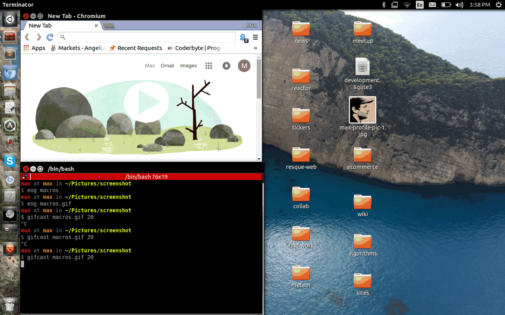

## **Keyboard Macros**

_usage gif_

### Summary
  - This uses the evtest linux program to get a stream of all keyboard events.
  - The events are parsed using Regex and keypresses are tracked.
  - Phrases are mapped to Ruby methods which are called when the phrase is typed anywhere.
  - Text can be programmatically added / removed under the cursor using xdotool helper methods.
  - This program evolved from my [artoo-keyboard-macros](https://github.com/maxpleaner/artoo-keyboard-macros) project.
  - The reason for redoing it was that artoo-keyboard doesnt support global listeners [link to github issue](https://github.com/hybridgroup/artoo-keyboard/issues/6)
  - [pty](http://ruby-doc.org/stdlib-2.2.3/libdoc/pty/rdoc/PTY.html) from Ruby's stdlib is used for the streaming I/O 
  - I tried to make this project easy to extend. The source code
    (minus dependencies) is only ~250 lines including comments, and it's all one file. Obfuscation and labyrinthine OOP is avoided,
    and the source code is attemptedly structured to place the most-often-changed sections at the top.
  - I'm not packaging it up as a gem because editing the source code is required to add macros.

### Installation
  - install dependencies:
    - `sudo apt-get install xdotool evtest`
    - clone the repo, `cd` in and run `bundle install`.
  - Then run the program: `./macros_server.rb`
  - Type anywhere (not just the terminal window) and notice how the text is captured.
  - A list of available macros (and the name of the Ruby method they trigger) can be seen in the terminal when the
    program is running. 
    - try typing `hello world`, which will open artoo.io in `chromium-browser`
    - or type `text entry`, which will type 'hello world' under the cursor.
      Note that the programmatically triggered keystrokes are **not** searched for
      additional macros. 

### Usage: How to add a macro:
  1. create an instance method in `CommandParser` (this is the event that is fired)
  2. map the event to a phrase by adding an entry to `@@macro_method_mappings` in `CommandParser`
  3. Note that characters supported in macro trigger strings are: `0-9, a-z (lowercase), and whitespace.`
    
### Usage: How to trigger key presses / deletes
  - **How to program a macro to enter text for me?**
  - There are three helper methods:
    - `CommandParser.trigger_deletes(n)` will trigger the 'BackSpace' key n times using `xdotool`.
    - `CommandParser.trigger_keystrokes(string)` will translate the string into `xdotool` instructions and enter the keystrokes.
    - `CommandParser.trigger_for(method_name)` looks inside `@@macro_method_mappings` to find the macro string which triggers a particular
    ruby method (event). This is used in conjunction with `trigger_deletes` to delete the trigger text. i.e.: 
    `CommandParser.trigger_deletes(CommandParser.trigger_for("my_ruby_method").length)` will delete whatever text was used to trigger the method.
  - More characters are accepted when triggering keypresses than when
    defining macro phrases. In addition to supporting `0-9, 'a'-'z' and whitespace` like macro phrases,
    triggered keypresses can also include `'/', ':', ';', '@', '?', '&', and '.'`. This is so that urls and email addresses can be
    supported. 

### Caveat regarding sudo
  - This script uses sudo when calling evtest (which requires it)
  - **The script does not ask for sudo, and will just hang if the current user needs to use a password to use sudo.**
  - For just testing this out one can run a command like `sudo pwd` and then run `macros_server.rb` in the next 5 minutes.
  - The  timeout of sudo can be increased by running `sudo visudo` and changing the value of `Defaults:user_name timestamp_timeout`.
  - Alternatively, the script can be run like `sudo ruby macros_server.rb`. This uses sudo's ruby version (for Ubuntu, the standard is still 1.9.3).
    In this case, all gems need to be installed as sudo, and different paths are needed to call system programs like `chromium-browser`. 

### Contributing / todos
  - The following features would benefit the program.
    1. Being able to trigger any keystroes, not just `0-9, 'a'-'z', whitespace, '/', ':', ';', '@', '?', '&', and '.'`. This could be done by editing `CommandParser.trigger_keystrokes`.
    3. Supporting more characters in macro phrases, including single-keypress named characters like `,./';[]=-` and multi-keypress characters like `!@#$%^&*()_+?><:"{}`.
    3. Supporting variables in macros, i.e. `email maxpleaner@gmail.com` could use the email address as a varaible.
